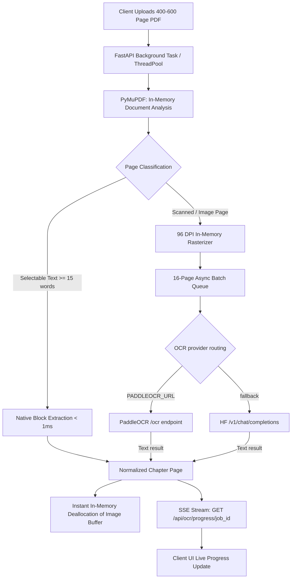

# Bookflow Backend Architecture & DevOps Workflow

Production-grade engineering and DevOps documentation for the Bookflow FastAPI OCR backend.

---

## 1. System Architecture & Performance Target

- **Processing target**: Keep page-level progress, bounded concurrency, cancellation, and cleanup predictable. Runtime varies with page size, OCR engine, hardware, and provider limits; do not promise a fixed time for 400–600 page books.
- **Microsecond Native Fast-Path**: Selectable text pages are extracted via PyMuPDF (`fitz`) in under 0.5 seconds for a 600-page book.
- **In-Memory 96 DPI Rasterization**: Scanned pages are rendered to JPEG base64 directly in RAM using CPU thread pools without touching the physical disk.
- **Asynchronous Batching**: Parallel non-blocking worker pools dispatch page batches through PaddleOCR first and the model configured in `OCR_MODEL` as fallback.
- **Zero Disk Persistence**: Document binaries and OCR buffers exist purely in volatile RAM during the request lifecycle.

---

## 2. Directory Structure & Layer Responsibilities

```text
backend/
|-- app/
|   |-- core/
|   |   |-- __init__.py
|   |   `-- config.py            # Pydantic BaseSettings, 0.0.0.0 host, selected HF model, limits
|   |-- models/
|   |   |-- __init__.py
|   |   |-- document.py          # NormalizedBook, Chapter, Subheading contracts
|   |   |-- ocr.py               # OCRPageResult, OCRDocumentResponse, OCRBatchResponse
|   |   `-- reader.py            # Notes, bookmarks, reading time, segmentation schemas
|   |-- routers/
|   |   |-- __init__.py
|   |   |-- health.py            # GET /api/health, GET /api/info
|   |   |-- ocr.py               # POST /api/ocr/image, /batch, /pdf, GET /api/ocr/models
|   |   |-- documents.py         # POST /api/documents/parse, POST /api/documents/validate
|   |   `-- reader.py            # POST /api/reader/segment, /reading-time, notes export/import
|   |-- services/
|   |   |-- __init__.py
|   |   |-- huggingface_ocr.py   # Hugging Face OpenAI-compatible Qwen vision client
|   |   |-- paddle_ocr.py        # PaddleOCR-compatible HTTP adapter
|   |   |-- ocr_service.py       # High-throughput batch & hybrid PDF orchestrator
|   |   |-- document_service.py  # Multi-format document parsing (PDF, EPUB, TXT, MD)
|   |   `-- text_service.py      # Sentence boundary segmentation & reading metrics
|   |-- __init__.py
|   `-- main.py                  # Standard app factory
|-- context-file/                # Engineering specifications & roadmap
|-- tests/                       # Pytest test suite
|-- Dockerfile                   # Multi-stage production container definition
|-- main.py                      # Unified high-throughput streaming server & SSE endpoints
|-- requirements.txt             # Python dependency manifest
|-- run.py                       # Local dev runner with Desktop & Mobile LAN detection
`-- README.md                    # Backend setup instructions
```

---

## 3. High-Throughput Processing Pipeline



---

## 4. REST & SSE API Reference

| Endpoint | Method | Purpose | Key Parameters |
| --- | --- | --- | --- |
| `/api/ocr/scan` | `POST` | Ingests PDF, starts async job, returns job ID | `file` (PDF binary), `force_ocr` (bool) |
| `/api/ocr/progress/{job_id}` | `GET` | SSE real-time page-by-page progress stream | `job_id` (str) |
| `/api/ocr/job/{job_id}` | `GET` | Instant snapshot of job state & processed pages | `job_id` (str) |
| `/api/ocr/result/{job_id}` | `GET` | Final structured Markdown document download | `job_id` (str) |
| `/api/ocr/models` | `GET` | Show the configured OCR model | None |
| `/api/ocr/image` | `POST` | Single image OCR extraction | `file` (image binary), `model_id` |
| `/api/ocr/batch` | `POST` | Parallel batch OCR across image files | `files` (list of images) |
| `/api/documents/parse` | `POST` | Parse PDF, EPUB, TXT, MD to NormalizedBook | `file` (document binary) |
| `/api/documents/validate` | `POST` | Pre-flight validation of filename and size | `file_name`, `file_size_bytes` |
| `/api/reader/segment` | `POST` | Sentence and paragraph boundary segmentation | `text`, `language` |
| `/api/reader/reading-time` | `POST` | Compute 220 WPM duration metrics | `word_count`, `words_per_minute` |
| `/api/health` | `GET` | Service health status and engine connectivity | None |

---

## 5. Local Development & Deployment Workflows

### 5.1 Local Server (Desktop + Mobile LAN)
```bash
cd backend
python run.py
```
*Automatically determines your LAN IP and outputs:*
- **Desktop**: `http://localhost:8000/docs`
- **Mobile LAN**: `http://<YOUR_LAN_IP>:8000/docs`

### 5.2 GPU OCR Engine Containerization (Docker Compose)
```bash
# Start the optional self-hosted services + FastAPI backend
docker compose up -d

# Check live logs
docker compose logs -f
```

### 5.3 Automated Testing
```bash
cd backend
pytest -v
```

### 5.4 Python Package & Pip Build
```bash
cd backend

# Editable local installation with development dependencies
pip install -e ".[dev]"

# Build distribution wheels (.whl) and source archives (.tar.gz)
python -m build
```

