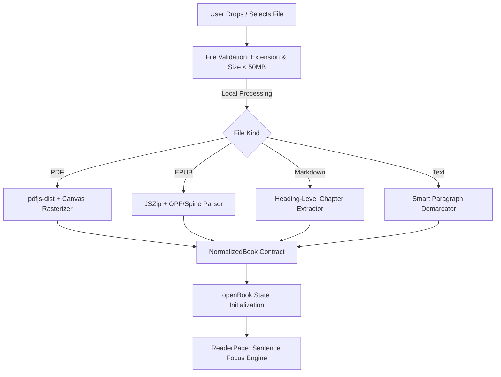
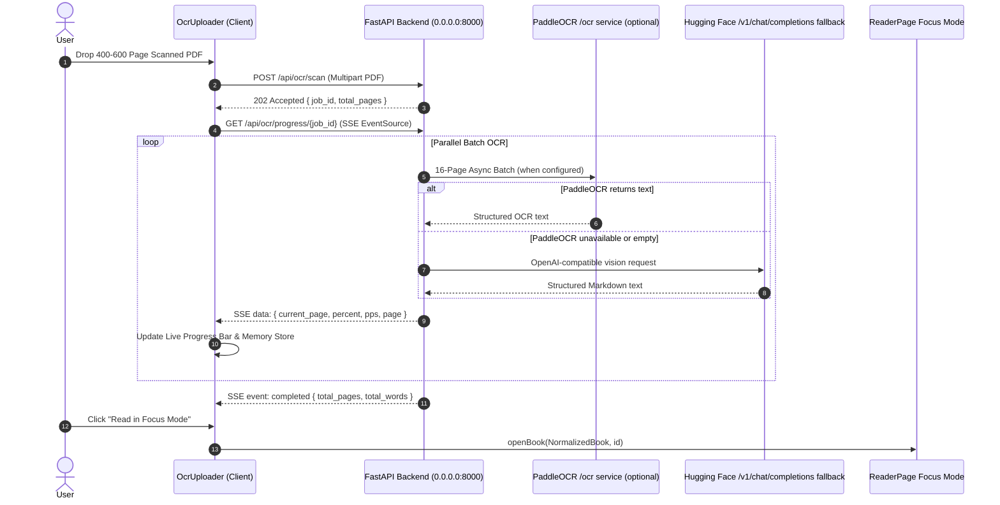

# Bookflow Frontend Architecture & Engineering Workflow

Production-grade engineering documentation for the Bookflow React 19 / Vite client application.

---

## 1. System Philosophy & Design Principles

- **Zero Content Persistence**: Document content exists strictly in ephemeral client memory or active reader runtime. Book text is never uploaded to remote servers or third-party tracking services without explicit user initiation.
- **Sentence & Whole-Paragraph Focus**: As the user scrolls, a calm highlight settles on the active reading unit near the 38% viewport focus rail.
- **Windowed DOM & Memory Efficiency**: The reader body uses chapter windowing for books above 1,500 paragraphs. A 420-page native-text probe rendered two chapter sections while retaining chapter metadata for navigation.
- **Apple-Inspired Aesthetic**: High contrast, subtle edge highlights, dusk near-black palette (`#111114`), and warm paper palette (`#fbfbfa`).

---

## 2. Directory Structure & Architecture Boundaries

```text
index.html                       # SPA HTML entrypoint
vite.config.js                   # Vite config with OCR assets & backend proxy
src/
|-- main.jsx                     # React root mount (StrictMode)
|-- components/
|   `-- OcrUploader.jsx          # Compatibility facade for feature-owned OCR session/viewer
|-- features/
|   |-- document-import/         # In-browser format parsers (PDF, EPUB, TXT, MD) & validation
|   |   |-- lib/
|   |   |   |-- documentParsers.js
|   |   |   |-- epubParser.js
|   |   |   |-- fileValidation.js
|   |   |   |-- markdownParser.js
|   |   |   |-- pdfOcr.js
|   |   |   |-- pdfParser.js
|   |   |   `-- textParser.js
|   |   `-- index.js
|   |-- landing/                 # Landing shell, hero upload dropzone & sample book
|   |   |-- components/
|   |   |   |-- BookOpeningIntro.jsx
|   |   |   `-- LandingPage.jsx
|   |   |-- sampleBook.js
|   |   `-- index.js
|   `-- reader/                  # Core sentence-focus reader, focus rail, & panels
|       |-- hooks/                # Session, navigation, measurement, input, window effects
|       |-- components/
|       |   |-- ContentsPanel.jsx
|       |   |-- FocusCard.jsx
|       |   |-- NotesPanel.jsx
|       |   |-- ReaderPage.jsx
|       |   `-- SettingsPanel.jsx
|       |-- lib/
|       |   |-- focusEligibility.js
|       |   |-- focusRail.js
|       |   |-- readerViewport.js
|       |   |-- readingController.js
|       |   `-- readingTime.js
|       |-- config.js
|       `-- index.js
|-- shared/
|   |-- components/
|   |   |-- Brand.jsx
|   |   |-- LoadingOverlay.jsx
|   |   `-- index.js
|   `-- lib/
|       |-- storage.js           # LocalStorage safe serialization & restoration
|       |-- text.js              # Word count, sentence splitting & sanitization
|       `-- index.js
|-- store/
|   |-- readerStore.js           # Zustand reader state management
|   `-- uiStore.js               # Zustand UI state management
|-- App.jsx                      # Root composition; import/library hooks own workflows
`-- styles.css                   # Responsive styles, theme tokens, animations, layout grids
```

---

## 3. Core Frontend Workflows

### 3.1 Document Ingestion & Local Parsing Flow



### 3.2 Configured OCR Pipeline Flow



---

## 4. UI/UX Interaction & Performance Engineering

### 4.1 38% Viewport Focus Rail Heuristic
The reader viewport dynamically computes an active target line at `38%` from the top of the reading container. Scroll intent is accumulated with sub-pixel momentum smoothing:
- Pinned focus (`Space` / `Enter` / tap) locks the active unit in place while permitting contextual free scrolling.
- Non-body front matter (Table of Contents, Copyright, Dedication) and end matter (Index, Bibliography) automatically activate native fluid scrolling with quiet metadata labels.

### 4.2 Windowed DOM for 600-Page Documents
Long books use chapter-level windowing above 1,500 paragraphs. The reader retains enriched chapter data, renders the active chapter window, and uses spacers to preserve scroll position. Chapter navigation metadata remains available in the navigator. The 420-page native-text browser probe reached 100% before opening the reader, mounted two chapter sections, and had zero horizontal overflow at 390px.

### 4.3 SSE Keepalive & Mobile Safari Resilience
Mobile WebKit and Chrome on Android drop long-lived HTTP connections if no payload is received for ~30 seconds. The SSE connection:
- Listens for `: keepalive\n\n` comments every 8 seconds.
- Automatically handles stream reconnection with monotonic state recovery.

---

## 5. Development, Verification & Build Workflow

```bash
# Start local frontend dev server with mobile LAN host binding
npm run dev -- --host

# Run ESLint validation
npm run lint

# Run Vitest test suite
npm test

# Run Playwright smoke and long-import coverage
npm run test:e2e

# Validate the brainobs graph
npm run check:vault

# Build production bundle
npm run build
```
